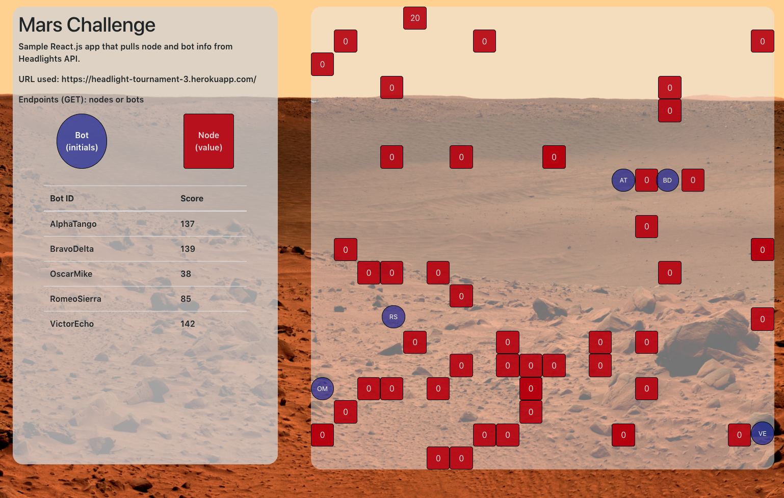

# [Headlight's Mars Discovery](https://headlight-mars-discovery.herokuapp.com/)

## Features

- Pulls node/bot information from Headlight's API via GET requests.
- React.js / create-react-app used to display relevant information.
- Mobile-responsive, but desktop-first.

## Tech Stack

- React.js
- Bootstrap 4

## My Approach

I used React.js library because values were constantly changing (especially bot locations), which meant that there would be many changes to the DOM. With the React's virtual DOM, there would be efficient DOM manipulation and it would only be touched if there were any changes. 

To fetch data from the API, I used Fetch API since it did not require any external library and it was relatively easy to use. Since everything was a GET request, fetching data was relatively simple.

I used Bootstrap to style my app, since it was easy to use and I was short on time. It allowed me to spend more time on overall layout/design rather than spending extra time styling each component indvidually. 

## Tradeoffs

I did not incorporate Redux into the app, since I'm not too familiar with it and I was short on time. I passed props from parent to great-grandchildren (3-4 levels) one at a time through the chain. It could have been avoided/optimized with Redux.

Writing this README takes time as well, so I had to forgo code clean up and refining my css (such as sprites for bots/nodes). I had a tradeoff to make between making it slightly mobile responsive versus making the css/ui 'prettier'. I went with mobile responsiveness, although it is not that responsive on tablet devices. Bootstrap's grid system saved a lot of calculations, but custom media queries are the way to go to make it more mobile/tablet responsive. The map is also cluttered on phone view (according to Chrome's Dev Tools Device Toolbar) so perhaps using fixed width might have been better.

## Future goals

In the future, I would make the graphics slightly more flashy/modern rather than a plain red box to illustrate nodes and blue circles for bots. I would also better organize the structure of the app/directory to make it easier to navigate.

I would also refactor my code and not use absolute positioning when possible. Currently my legend uses absolute positioning, and it causes it to overlap at certain device sizes, such as 4k displays.

In addition, I would make more data available such as Node ID as a hoverable tooltip. This ties into making the app more interactive.
